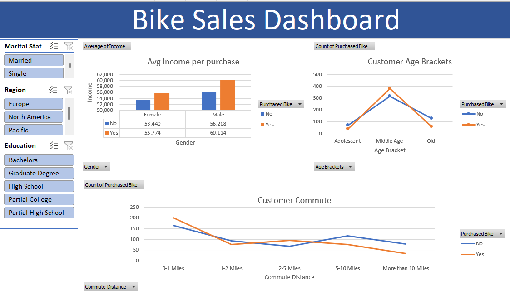

# 🚴‍♂️ Bike Sales Dashboard  

## 📌 Overview  

Bike Sales Analysis using Microsoft Excel is a dynamic project meticulously crafted to harness the power of Excel for insightful data exploration. the project showcases the ability of Excel to transform raw data into actionable insights. This project offers valuable lessons in data manipulation and interpretation. Dive into the realm of sales analytics with Bike Sales Analysis using Microsoft Excel and unlock the potential of spreadsheet software in unraveling business trends

This Excel Dashboard provides a detailed analysis of bike sales trends based on key customer demographics and behaviors. The interactive dashboard allows users to explore how different factors influence bike purchases.

## 🔧 Tools Used  
- **Microsoft Excel** (Pivot Tables, Pivot Charts, Slicers, Conditional Formatting)

## Data Cleaning and Transformation
This stage began with getting to know the dataset and checking for any data quality issues.
- Removing duplicates, unwanted cells and irrelevant columns.
- Replacing values with more meaningful entries using FIND and REPLACE functions. eg: M with Married in the "MaritalStatus" column, F with Female in the "Gender" 
  column etc
- Changing the data type of "Income" column to currency.
- Creating a conditional column based on the "Age" column to make out 3 different age brackets.using NESTED IF function

## 📌 Key Insights & Features

- **Demographic Insights**
Income Levels: Customers with higher average income tend to purchase bikes more frequently.
Age Brackets: Middle-aged customers are the largest segment purchasing bikes.
Gender: Males have a slightly higher purchase rate compared to females.

- **Customer Behavior Analysis**
Commute Distance: Customers commuting shorter distances (0-1 miles) show a higher likelihood of purchasing a bike.
Education Level & Region Filters: Users can analyze bike sales by education levels and geographic regions.

- **Interactive Features**
Slicers for Filtering Data: Users can filter by marital status, region, education level, gender, and more.
Dynamic Charts: Visual representation of sales trends, making it easy to interpret key findings.

## 📌 Future Improvements
- Enhancing visual appeal with better formatting and charts.
- Adding more data fields for deeper insights.
- Automating data updates using Excel macros or Power Query.
